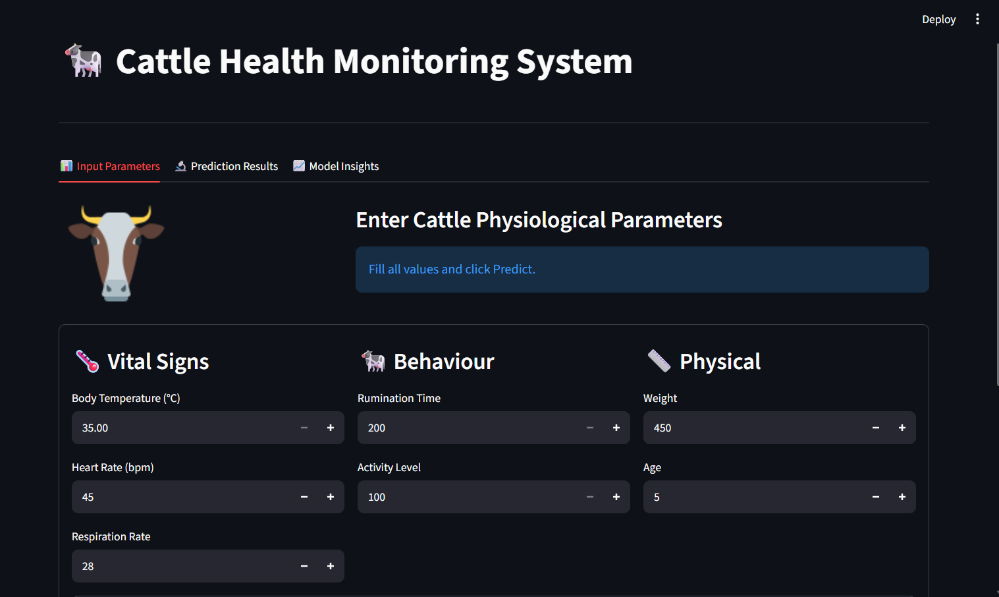
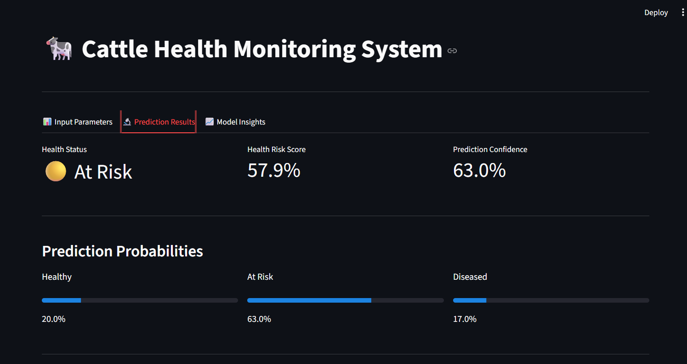
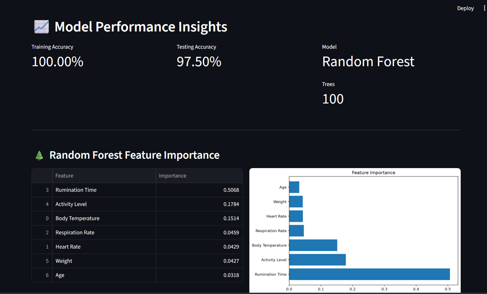

# Cattle Health Monitoring System

A Machine Learning-based web application that predicts cattle health status using health parameters such as body temperature, heart rate, respiratory rate, activity level, rumination time, weight, and age.

## Project Objective

The objective of this project is to help farmers monitor cattle health using Machine Learning. The system predicts whether cattle are healthy or unhealthy based on physiological parameters and provides model explanations using SHAP and LIME.

## Live Demo

 https://cattle-health-monitoring-6rpdgplrb26ugu2oueqvpn.streamlit.app/

## GitHub Repository

 https://github.com/murasaniakhila1234-bot/cattle-health-monitoring

## Features

- Predicts cattle health status
- User-friendly Streamlit interface
- Machine Learning (Random Forest) prediction
- SHAP and LIME model explanations
- Fast and accurate predictions

## Technologies Used

- Python
- Streamlit
- Scikit-learn
- Pandas
- NumPy
- Matplotlib
- SHAP
- LIME

##  How to Run Locally

1. Clone the repository
2. Install the required packages

```bash
pip install -r requirements.txt
```

3. Run the application

```bash
streamlit run cat.py
```

## 📸 Screenshots

### Home Page



### Prediction Page



### Insights



##  Developed By

**Akhila Murasani**
